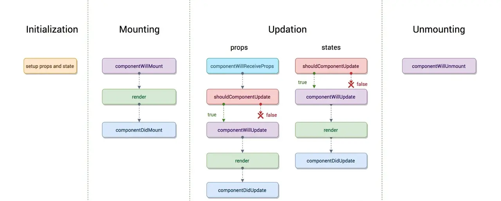

# React旧版生命周期
图览

* 初始化阶段
* 挂载阶段
* 更新阶段
* 卸载阶段

## 初始化阶段
发生在constructor里面，初始化state、props，在这个阶段可以修改state，并且不会执行更新阶段的生命周期

## 挂载阶段
#### 1、componentWillMount
发生在render之前，还没有挂载dom

#### 2、render
开始渲染dom

#### 3、componentDidMount
发生在render之后，此时已经挂载Dom

## 更新阶段
更新阶段分别游state和props更新引起的

### props
#### 1、componentWillReceiveProps(nextProps, nextStats)
这个生命周期主要为我们提供对props发生改变的监听，如果需要在props变更后修改state的值，可以在这里直接修改state,修改不会引起二次生命周期，这里会做合并
#### 2、shouldComponentUpdate(nextProps, nextStats)
这个生命周期需要返回一个Boolean值，判断是否需要更新渲染组件（优化react应用的主要手段之一）,返回 false时不会继续向下执行生命周期，这里不能 `steState()`，会导致循环调用

#### 3、componentWillUpdate(nextProps, nextState)
这个生命周期主要给我们一个时机能够处理一些在Dom发生变更之前的事情，比如获取Dom更新前的坐标、大小等信息，不能`steState()`，会导致循环调用。
一直到这里 `this.props` 和 `this.state` 还未发生变更
#### 4、render
执行render函数
#### 5、componentDidUpate(preProps, preState)
在此时已经完成了更新渲染，Dom已经发生变化，State已经发生更新，preProps、preState均为上次的值

### state（大致同上）
*  1、shouldComponentUpdate
*  2、componentWillUpdate
*  3、render
*  4、componentDidUpdate

## 卸载阶段

#### componentWillUnmount
componentWillUnmount 会在组件卸载及销毁之前调用。这里可以用来清除订阅、计时器等

# 新版生命周期
React 16版本中删除了如下三个生命周期
* componentWillMount
* componentWillReceivePorps
* componentWillUpdate

官方给出的解释是 react 打算在17版本推出新的 Async Rendering，提出一种可被打断的生命周期，而可以被打断的阶段正是实际 dom 挂载之前的虚拟 dom 构建阶段，也就是要被去掉的三个生命周期。
本身这三个生命周期所表达的含义是没有问题的，但 react 官方认为我们（开发者）也许在这三个函数中编写了有副作用的代码，所以要替换掉这三个生命周期，因为这三个生命周期可能在一次 render 中被反复调用多次。

取代这三个生命周期的是两个新生命周期：

#### static getDerivedStateFromProps(nextProps, nextState)
在组件实例化、接收到新的 props 、组件状态更新时会被调用。
* 该方法可以返回一个对象，将会和 state 发生合并，且不会触发 re-render。这个生命周期主要为我们提供了一个可以在组件实例化或 props、state 发生变化后根据 props 修改 state 的一个时机，用来替代旧的生命周期中的 componentWillMount、ComponentWillReceiveProps。因为是一个静态方法，this 指向不是组件实例。

#### getSnapshotBeforeUpdate(preProps, preState)
在render函数调用之后，实际的Dom渲染之前，在这个阶段我们可以拿到上一个状态Dom元素的坐标、大小等信息。用于替代 componentWillUpdate。该函数的返回值将作为componentDidupdate的第三个参数出现
